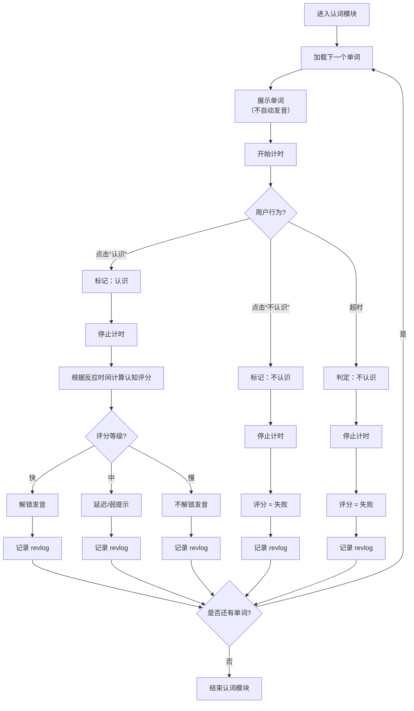

# 1.词善加 需求文档

> 如无必要 勿增实体
> 

[**产品需求文档 (PRD) - 草案 V1.0**](https://www.notion.so/PRD-V1-0-2b6b07e89ee280468e43c9334bde66f0?pvs=21)

[与AI产品经历的对话](https://www.notion.so/AI-2bab07e89ee2808bb802d50727ee322f?pvs=21)

按照课本学习是好的 这样每次学习都有针对性，更加专注，不能快高考了系统还安排小学课本句子的复习，不过这个可以设定一个开关，或者可以让用户有选择哪几个课程一起复习。这是一个过滤器，标签是过往学的课程，被选中的课程可以一起复习，但是这样可能会出现账号共享的情况，每个人的学习进度可以被隔离

形→义：认词，

默写，

听写

## 量化规则

记忆引擎档位：应该是记忆效果越好档位越高，复习间隔时间越长

# 荣誉系统

这个系统下一共有四个选项tag供用户选择查看。

## 每周奖牌✅

每周奖牌

这里显示统计

学习周数：“你已学习 3 周”

这证明从用户开始学习的第一个自然周开始，一共有三个自然周存在学习记录，

奖牌数量统计：“共获得奖牌2 枚”

这里的奖牌数量是自注册系统开始学习以来获得所有种类的奖牌的的总数量。要注意：每周获得的金币数量越多自动对应认证的奖牌也就越多，奖牌不是金币“买”来的，而是认证来的。

每种奖牌数量分别统计：

一共7种奖牌图标，从左到右一行排列，图标下方是对应奖牌的名称，上方是自注册系统以来获得的对应奖牌数量

以上的内容占整个界面高度的 20%

下面以自然周为单位，用卡片的形式显示每周获得的奖牌种类，每张卡片有三行信息：

第 xx 周

奖牌图标🥇

奖牌名称

每行有 5 列卡片，日期从左到右，从上到下按照由近到远的规则排列

如果本周学习没有达到 100 个金币那就无法获得最低级的奖牌，这时候卡片三行从上到下分别显示第 xx 周、一个灰色空白奖牌以及显示“空空如也”字样

页面边缘位置有一个提示按钮：「每周奖牌攻略」点击之后可以弹窗显示七种奖牌名称、图标样式、获得要求，是一个一共的3列7 行的表。弹窗之后背景模糊显示

奖牌规则

> 勤勉顽石
> 
> - 周获得金币数达到99枚

> 英勇黑铁
> 
> - 周获得金币数达到199枚

> 不届青铜
> 
> - 周获得金币数达到299枚

> 无畏白银
> 
> - 周获得金币数达到599枚

> 荣耀黄金
> 
> - 一周获得金币数达到999枚

> 华贵铂金
> 
> - 一周获得金币数达到1499枚

> 璀璨钻石
> 
> - 一周获得金币数达到1999枚

## 课程证书

课程证书

这里显示统计学习周数、学完课程的数量，课程证书的数量。

“你已学习 1周，共学完0个课程，荣获 0个课程证书。”

页面边缘位置有一个提示按钮：「课程证书攻略」，点击之后弹窗显示如下提示：

课程证书攻略

> 1.如何才能获得课程证书?
选择任意一版本教材，在任一模块下完成所有单词的学习，并且闯关测试成绩不低于95分，即可获得该教材该模块的课程证书。
2.一个课程最多能获得多少课程证书?
一个课程最多可获得11个课程证书，即“智能认词"、“智能听词”、“智能听写"、“智能默写”、“智能用词”、“例句听组”、“例句听力”、“例句翻译”、“例句听写”、“例句默写”和“全能证书”
3.什么是全能证书?
完成一个课程对应的十个模块的学习后并该十个模块的闯关测试都通过后获得“全能证书”。
> 

## 等级证书

等级证书

页面显示“我的等级：Lv1 ”，字样

一个进度条，进度条上方左侧是现在所处的等级“1 级”，字样高亮显示，同进度条颜色一致，进度条上方右侧是的下一个待达成的等级“2 级”，字样灰度显示；进度条下方是左对齐提示字样：距离下一个等级还差xx学分哟！进度条下方还有右对齐的完成度比例提示：4/100，表示达到下一级需要 100 个学分现在已有 4 学分。

这张图片展示的是一个等级进度条界面，以下是详细描述：

## 整体布局

界面采用横向布局，背景为浅青色/薄荷绿色，展示用户当前等级及升级进度。

## 左侧区域 - 当前等级显示

- **文字标签**："我的等级："（灰色/深色文字）
- **等级数值**："Lv1"（橙色粗体大字，视觉突出）

## 中间和右侧区域 - 进度条系统

**进度条设计**

- 横向长条形进度条，贯穿整个区域
- 进度条分为两个等级节点：
    - 左侧标记"1级"（绿色文字）
    - 右侧标记"2级"（灰色文字）

**进度显示**

- 已完成部分：绿色填充，从左侧开始
- 未完成部分：灰色填充
- 当前进度约为4-5%左右

**进度文字说明**

- 位于进度条下方
- 内容："距离下一个等级还差96字分啊！" （灰色文字）
- 右侧显示具体数值："4/100"（灰色文字）

## 视觉层次

1. **主标题层**："我的等级" + "Lv1" - 强调当前状态
2. **进度可视化层**：绿色和灰色双色进度条 - 直观展示进度
3. **信息提示层**：文字说明和数值 - 明确告知用户还需努力的目标

## 交互逻辑

- 用户当前处于Lv1等级
- 需要累计100字分才能升到Lv2
- 已完成4字分，还差96字分
- 进度条视觉化展示完成度（4%）

## 设计特点

- **颜色语义明确**：绿色表示已完成，灰色表示未完成，橙色突出当前等级
- **信息完整**：既有视觉化的进度条，又有具体的数字说明
- **激励性文案**："还差96字分啊！"带有鼓励性质的感叹号
- **简洁直观**：整个界面信息密度适中，一目了然

这是一个典型的用户等级系统界面，常见于学习类、游戏化应用中，用于展示用户当前成长状态并激励用户继续学习。

页面边缘位置有一个提示按钮：「等级证书攻略」，点击之后弹窗显示如下提示：

等级证书攻略

| 等级
级
二级
三级
四级
五级
六级
七级
八级
九级
十级
十一级到二十级
二十一级到无限

 | 晋级要求
总学分数为0到99
总学分数为100到299
总学分数为300到599
总学分数为600到999
总学分数为1000到1499
总学分数为1500到1999
总学分数为2000到2499
总学分数为2500到2999
总学分数为3000到3499
总学分数为3500到3999
每获得1000个学分升到一级(4000到13999)
每获得2000个学分升到一级(14000到正无穷) |
| --- | --- |

## 成就勋章

成就勋章

### 整体布局

顶部状态栏

左侧显示"共获获成就勋章：0枚 / 10枚"（橙色高亮显示0枚）

右侧有"成就勋章攻略"按钮

主体内容
界面采用网格布局，分为两行，每行5个功能卡片，共10个功能模块。

**第一行功能卡片（从左到右）**

**课堂大明星**

- 图标：三个点的对话框样式
- 等级：Lv0
- 进度：累计答题 2/30
- 进度条：绿色，显示约6-7%

**无敌学霸**

- 图标：戴眼镜的卡通人物头像
- 等级：Lv0
- 进度：连续签到 1/30
- 进度条：绿色，显示约3%

**记忆狂人**

- 图标：大脑/记忆相关图标
- 等级：Lv0
- 进度：智能认词 13/100
- 进度条：绿色，显示约13%

**词听大神**

- 图标：扬声器/音量图标
- 等级：Lv0
- 进度：智能听词 0/100
- 进度条：灰色，未开始

**顺风耳**

- 图标：三个点的对话框样式
- 等级：Lv0
- 进度：智能听写 0/100
- 进度条：灰色，未开始

**第二行功能卡片（从左到右）**

**拼写王**

- 图标：键盘图标
- 等级：Lv0
- 进度：智能默写 0/100
- 进度条：灰色，未开始

**听力高手**

- 图标：耳朵/听力相关卡通图标
- 等级：Lv0
- 进度：例句听力 0/100
- 进度条：灰色，未开始

**听组大仙**

- 图标：耳朵/听力相关卡通图标
- 等级：Lv0
- 进度：例句听组 0/100
- 进度条：灰色，未开始

**翻译官**

- 图标：汉字"译"在圆形徽章中
- 等级：Lv0
- 进度：例句翻译 0/100
- 进度条：灰色，未开始

**神来之笔**

- 图标：笔/书写工具图标
- 等级：Lv0
- 进度：例句默写 0/100
- 进度条：灰色，未开始

**设计特点**

**统一的视觉风格**：所有图标都采用圆形徽章设计，中间显示"Lv0"等级标识

**进度可视化**：每个卡片底部都有进度条，已完成部分显示绿色，未完成显示灰色

**虚线边框**：每个功能卡片都有浅色虚线边框分隔

**层次分明**：标题、图标、等级、进度文字、进度条垂直排列，信息层次清晰

**游戏化设计**：采用勋章、等级、成就系统，增强用户学习动机

这是一个典型的游戏化学习界面，通过成就系统激励用户完成各种语言学习任务。

点击“成就勋章攻略”按钮，有以下弹窗

成就勋章攻略

# 金币

- 温馨提示:金币分为学习类金币和奖励类金币，其中学习类金币每天金币上限500，超过不再获得金币;奖励类金币没有上限，但是有次数限制。
- 学习类金币
    - 学习金币:学习过程中每累计一分钟有效时长获得1个金币
    - 测试金币:
        - 测试过程中每累计一分钟有效时长获得1个金币
        - 智能认词首次闯关通过奖励10个金币，刷新成绩获得10个金币。
        - 智能听写、智能默写首次闯关通过获得20个金币，新成绩获得20个金币。
        - 极速挑战第一次获得100分奖励10个金币。
        - 例句模块首次闯关通过获得30个金币，刷新成绩获得30个金币
        - 自然拼读首次闯关通过获得10个金币，刷新成绩获得10个金币，
        - 母语词汇检测测每通过一个单词获得1个金币。
- 奖励类金币
    - 抢红包:
        - 复习红包:每天可以抢两次复习红包(0点-12点一次，12点-24点一次)，测试大于90分即可抽红包，红包内包含10-30个随机金币
        - 巩固红包:每天可以抢两次巩固红包(0点~12点一次，12点~24点一次)，测试大于90分即可抽红包，红包内包含10-30个随机金币推荐奖励金币:被推荐人学习或者测试获得的金币每超过10个就奖励推荐人1个金币。
- 每日首次登录获得5个金币。
- 累计登陆奖励(需去登录奖励页面手动领取)
    - 当月累计登录2天获得10金币登录礼包。
    - 当月累计登录5天获得15金币登录礼包。
    - 当月累计登录10天获得20金币登录礼包
    - 当月累计登录17天获得30金币登录大礼包
    - 当月累计登录26天获得50金币登录大礼包。
    - 当月坚持每一天都登录学习，获得100金币终极登录大礼包
- PK:每人每天有4次pk机会，获胜的人将赢得金币，输的人扣除金币，金币数量由发起人设置，范围在1~50之间。
- 生日奖励:生日当天登录学习平台可以领取生日卡片，其中包含100个金币+额外的2次pk机会。
- 意见反馈:如果你反馈了有建设性的问题或意见时，官方客服会给你回复信息并奖励0~10个金币作为奖励。

# 倒计时

要求选择选项的页面倒计时：`5s`

要求拼写单词的页面倒计时：`倒计时=单词字母长度*2s`

例如：

强化记忆要求拼写单词来检查是否真的认识，`倒计时=单词字母长度*2s`

单词默写模式，`倒计时=单词字母长度*2s`

单词听写模式，`倒计时=单词字母长度*2s`

学习时间，从用户每次开始进入学习界面开始计时

# 有效时长

有效时间在各个学习维度上的计算方法略有不同。

### **形→义：认词**

**“有效时间”的概念定义：**

情形一：在5s之内点击笑脸，之后点击对号，那么有效时间是从倒计时开始到点击对号这段时间；

情形二：5s 笑 错有效时间

从自动发音跟读到进入下一词这中间的有效时间每个词都是固定的是：（系统发音时间*2）+（跟读间隔时间*2），超出这个时间就不计算进有效时间了

举例：deteriorate 从出现开始计时中间点击笑脸最后点击对号用时9s（ 所以注意力时间从15s累积到24s，同时学习时间也从55s 到 1min04s）

[10月28日(1).mov](1%20%E8%AF%8D%E5%96%84%E5%8A%A0%20%E9%9C%80%E6%B1%82%E6%96%87%E6%A1%A3/10%E6%9C%8828%E6%97%A5(1).mov)

每次开始进入本场游戏的有效时长都会清零。当天的有效时长是每场游戏有效时长的累积。

如果是从复习点击进入的游戏，那么复习结束后自动转入本游戏模式下新词学习。

### 形→音：跟读

### 音→形：听写

### 音→义：听选/听词

### 义→音：说词

### 义→形：默写

### 本次学习

[生词:2个 熟词:6个 复习:8次]

词义记忆阶段，一个新词在5s倒计时内被点击笑脸，并且之后被点击对号，则熟词+1；

如果超过5s倒计时，则生词+1

如果点击哭脸，则生词+1

生词每被复习一次则复习+1

学习进度:8/90

### 词意强化

2+5+gossip一共是8个，加上最开始复习的两个，十个所以这之后开始了词意强化。这里的复习显示有4个词，除了最初的2个还有本次学习游戏中遇到的2个生词。11:05

### 记忆追踪

记忆追踪是利用“记忆引擎”技术，将你已学单词(句子)中的生词(句)自动挑选出来，颜色越深、字体越大的单词(句)需优先复习。记忆追踪根据你的记忆规律，结合每个单词(句子)的**记忆次数、反应时间、记忆难度、记忆强度**等指标，精准运算出黄金记忆序列，并进行记忆优化，确保每个学员都能用最少的时间达到母语式记忆效果。

数据结构的设计

### 学习进度

七个圈对应七种学习维度，〇→●→ ✅→👑 分别对应0123颗星。

> 只是完成学习会显示●；如果最近一把闯关失败会显示❌普通模式完成显示✅；极速挑战完成显示⚡️；两种挑战都完成显示👑
> 

完成学习之后有三种测试规则：

第一种试卷模式，只设定总时间限制

第二种逐个四选一，只设定总时间限制，每个题可以多次选择（开枪），只计算最后总成绩。

第三种逐个四选一，每个选择时间有5s，超过5s自动跳转下一题。

第四种是我自己想的，也是逐个四选一，每个选择时间5s，到时间跳转下一题，选择之后也自动跳转下一题；没有反悔的余地，没有开第二枪的机会。

拼写修改的例子：

**Hike**拼写成hight，即使hi 没有标注为红色 在要求用户重新书写的时候应当从头开始 完整的拼写而不是从hi之后要求用输入 

形→义：认词的书写没有倒计时 但是音→形：听写是有的

智能认词每次测试开始前，会把上次错误的单词生成出来让你先学习 再复习，

优先级规则：

1.词义强化中不插入「老词到期复习」

2.老词到期复习>新词学习

3.单元测试前检查是否有老词到期，到期则先老词到期复习再开始测试。

词义强化的输入拼写检查：

**Hike**

拼写成hight

即使hi 没有标注为红色 在要求用户重新书写的时候应当从头开始 完整的拼写 帮助形成肌肉记忆

智能认词的书写没有倒计时 但是智能听写是有的

## 核心界面设计：

考验方式一共六种，为什么要拆分成六种？为什么单词你老是记不住？那就是人的大脑的带宽其实没有想象的那么高，你看一个单词的时候，他后面可能有很多个汉语意思，每一个汉语意思词性也可能不一样，你的大脑自以为一次学习，能够看到汉语意思，知道发音和拼写；听到发音，知道汉语意思和拼写，看到拼写就知道发音和汉语意思；传统的背单词没有针对性，更没有效率，对大脑来讲是一个种很混沌的学习方式。我们要做的就是观察，拆解真正掌握一个单词需要掌握单词的哪些维度，我们学习过程是针对以下六个向量的各个击破

# 形→义：认词

# 义→形：默写

显示单词汉语意思，等待用户输入发音对应的单词，等到按下回车启动批改。如果批改结果正确则进入下一个词，如果批改结果不完全正确就开始这个生词默写学习

所有的的生词由间隔重复算法实时计算安排下次复习时间，学习形式暂时同上述

# ~~形→音：跟读~~

# 音→形：听写

自动播放单词发音，等待用户输入发音对应的单词，等到按下回车启动批改。ctrl可以连续触发发音。如果批改结果正确则进入下一个词，如果批改结果不完全正确就开始这个生词学习

例子：

2025-11-10 at 7.49.53PM 20‘40“ adapt…to听写错误的学习流程和复习时间

生词学习流程：

复习时间：错在在线时间22’00“ 复习在22‘41”；错在有效时间21‘28”复习在22’08“

复习次序上：错在第五词，复习在第14词

- [ ]  将智能听写的顺序导入到剪映中 查看错误的词是在何时出现要求复习的

生词听写学习过程：

# 音→义：听选

听单词发音从四个汉语意思里选择一个

智能听词应当改名叫做智能听选，即从四个选项中选出一个汉语意思

# ~~义→音：说词~~

一个教材有以下模块的学习：

# 词汇x6：

“认词｜无汉义有发音两次确认认识”

出现一个单词good，播放发音/ɡʊd/，用户有5s的反应时间选择😊或者😭，（不要用认识/不认识来引导会让用户出现判断障碍，同理让用户选择几颗星来表示熟悉程度🌟🌟🌟🌟🌟也不可取）

第一种情况：

1. 在5秒以内用户选择了笑脸，
    
    
    
2. 系统会显示正确的汉语意思，并且再一次的播放发音/ɡʊd/，这次用户可以点击对号或者是错号。对号代表在点击笑脸的基础上，再次确认这个词是用户认识的，这样这个词被归类到熟词中。
    
    
    
    1. 用户点错号表示这个词我以为我认识，所以选择了笑脸，但是看到他的正确答案汉语意思之后，我发现我不认识或者不是我点笑脸的时候想的那样，所以我点击了错号，把这个词归类到生词中；

第二种情况在5秒以内用户选择哭脸😭，这个时候系统引导用户开始生词学习

第三种情况超出了5秒，

1. 这个时候计时器会显示已超时，但是除此以外界面不会发生变化；
2. 随后无论用户选择的笑脸还是哭脸，这个词都会被划入到生词并开始生词学习。

生词学习：这个时候系统会显示正确的汉语意思和例句，播放英文发音并顺序高亮单词**good**和汉语意思**好的良好的**，引导用户朗读高亮位置单词+词义，这两次朗读学习是强制性的，页面上也只有引导跟读的按钮（回车键触发），只有完成两遍朗读的学习，这个按钮才会提示进入下一个单词（回车键），当然这个时候希望继续朗读学习可以继续按ctrl键或者页面的发音按钮，这个功能在进入下一个认词之前不会消失

有效时间计算：

“听写”、“默写“、”选义“、”拼读“、”说词“；

# 过渡x1：

”用词“；

# 句子x6：

之所以拆成 6 个维度学习是因为：

人脑的带宽有限度的：一个单词显形、发音、释义、例句。在同一时间展示这么多信息的对有针对的记忆这词的某个方面并无好处，相反可以让用户随着自己的掌握程度的提升要决定每张卡片背面同时显示的信息维度。

以下截图来自'/Volumes/Extreme SSD/万词王/hss/3File .mov’

”例句听组｜无汉义有发音组句“

1.句子由系统自动发音

2.发音完毕显示单词，倒计时开始

3.回答正确显示提示音：叮～ 点击箭头进入下一题

”例句听力｜有发音选汉义“ 

1.英文句子由系统自动音

2.发音完毕开始倒计时，回答之后播放对应提示音，同时显示正确答案和错误答案，没有错误答案就不显示。

回答正确进入学习界面：
1.系统自动播放英文句子发音；2.显示重点词

”例句翻译｜有汉义无发音组句“

1.没有发音，直接给出汉语意思让选词组句翻译成对应的英文

2.回答正确，播放正确的音效，同时显示出正确答案和用户提交答案的批改结果

”例句听写 ｜有发音有汉义打字“

1.系统自动播放英文发音

2.用户输入后回车，系统开始比对：显示正确的答案和批改后的结果

3.如果有错误针对输入错误的词挖空，要求用户看着正确答案“抄写”

4.单词需要逐个字母的输入，系统会逐个的比对正确答案，输入正确就正常显示，输入错误系统会删除本次输入这个字母，并在正确答案上高亮显示正确的字母。

5.直到最后一词抄写正确，无需回车，系统检测到输入正确就会发出正确的提示音，界面这时候显示正确的答案和用户输入的正确答案。

“例句默写｜有汉义无发音打字“

1.倒计时时长是（字符数*2）s

2.点击回车，开始比对显示正确的答案和批改后的结果，错误就发出错误的提示音，正确的就发出正确的提示音

3.再次回车，进入到挖空抄写模式（哪里错挖哪里）：依旧是输入正确进入下一词，输入错误显示全部正确答案，删除本次输入错误的字母，并在正确答案上高亮输错的字母

4.抄写完成，不用回车自动开始比对，正确就显示正确的提示音，界面出现用户输入和正确答案以及重点单词，回车进入下一题

5.抄写正确之后，系统会立即安排重新默写，如果默写错误会重复上一抄写/比对循环，只有完全默写正确才会跳转下一词

💡比如这里整个句子都输入了，这个时候可以请问AI为什么错了，要求AI给出高质量的反馈，这个反馈就输出记录在这个词的表后面，可以记录本次错误，添加到错题本中。

---

例句跟读｜有汉义有发音跟读英文

例句口语｜有汉义无发音说英文？

# 备忘：

大小写是否敏感可以让用户有个开关设置，但是也要区别在排行榜上

包括标点是否检测。

关于取词入库，像是eudic 这样的软件都可以从屏幕取词加入生词本 并且可以导出，这样导出的文件可以上传到我们的系统中 只要是 excle 的格式的单词列表都支持导入，你就不用开发取词软件了 但是这无疑会增加用户操作难度和成本，做软件的目的不就是增加便利性吗，而且这样取词导入是不及时的，这个方案只有 50% 的可取性 适合 eudic 等老客户迁移数据，但不适合背词新人操作。

sm-2中的难度系数要用考试词频来表示吗？词频越高难度越低？这不好没有考虑到用户整体水平，所以单词的难度有什么统计方法？

词义强化里面的抄写错了算不算生词？（暂时不算吧）

间隔重复算法采用 fsrs

界面：

landing page

登录界面